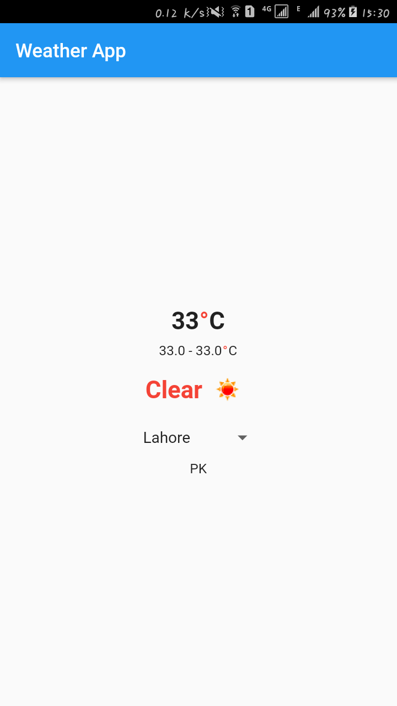
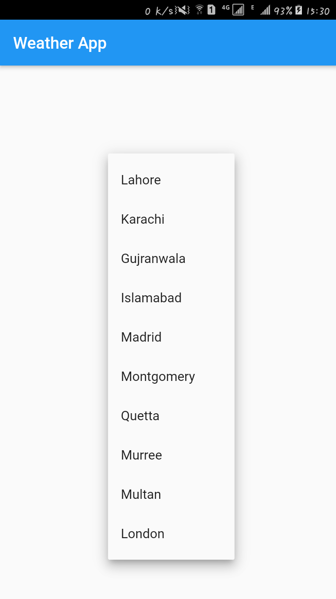
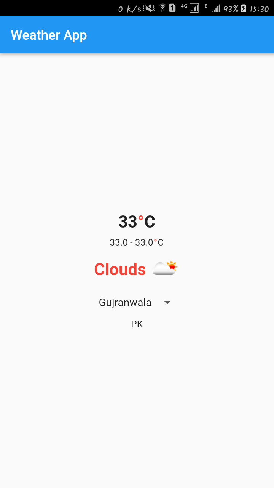

# weather_app

This is a simple weather app which is developed in flutter and dart.

## About

In this app user can see specific city temperature, weather, minimum temperature and maximum temperature. For city selection there is an drop down list of predefined some cities.

# Screenshots

## Weather with default city

## DropDownMenu List

## Weather after user city selection
